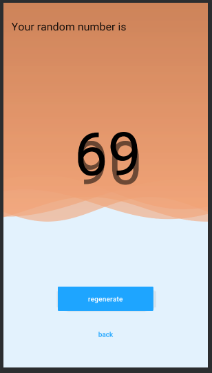

# Randomy
     

This is a simple random number generator app that lets the user set the range in which the numbers will start and end from
Enjoy the app
###### For app demo [click here](https://appetize.io/app/fp5y2y70htnjtp10mkvedyh5xg)
###### For app prototype [click here](https://projects.invisionapp.com/prototype/Randomy-cjvwi0tbs00907z010jfdypbj)
###### For app project management board [click here](https://www.pivotaltracker.com/n/projects/2349874)
###### For final app apk [click here](https://drive.google.com/open?id=1aXPBs4-QWQeMiFYejN1WLHyVjE4_suNa) to download

## Prerequisites
You will need the following to run this project:
1. A machine with internet access (Laptop or desktop)
2. Android studio 3.4 or later

## Setting up
* Clone the repository from GitHub
* Open the project folder using Android Studio IDE
* Wait to for build to finish and you're good to go

## Features
#### Start activity
On app start the user will be presented with a detailed information about the app and a button to continue.

#### Setting number range
The user can then set the range he/she wants the random number to be generated from.

#### Random number display
This page displays the random number with an option to regenerate the number again.

## Contributions
Find any typos? Have another resource you think should be included? Contributions are welcome!
* First, fork this repository
* Next, clone this repository to your desktop/laptop to make changes

		` $ git clone {YOUR_REPOSITORY_CLONE_URL}`

		` $ cd Randomy`

* Once you've pushed changes to your local repository, you can issue a pull request by clicking on the green pull request icon.

## License
The MIT License (MIT)

Copyright (c) [2019] [Brian Odhiambo](https://github.com/MamboBryan)
